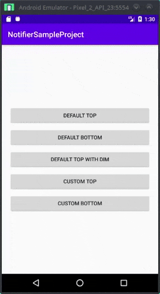

# Notifier

Notifier is an Android library for showing default or custom message blocks. You can completely customize it based on your needs. Changing animation speed and swipe to dismiss will be added soon.



## Installation

In build.gradle(project):

```bash
allprojects {
    repositories {
        ...
        maven { url 'https://jitpack.io' }
    }
}
```

In build.gradle(app):

```bash
implementation 'com.google.android.material:material:1.1.0'
```

## Usage

Show a default notifier:

```java
new Notifier.Build(MainActivity.this)
            .setPosition(Gravity.TOP)
            .setCornerRadius(20)
            .setBackgroundColor(R.color.green)
            .setTypeface(font)
            .setImage(R.drawable.ic_bell)
            .setTitle("This is title!")
            .setTitleColor(R.color.white)
            .setTitleSizeSp(18)
            .setDescription("This is description!")
            .setDescriptionColor(R.color.white)
            .setDescriptionSizeSp(16)
            .setDuration(5000)
            .setEnableAutoDismiss(true)
            .setEnableDimBackground(false)
            .setOnNotifierDismissListener(() ->
            {
                // do something when notifier dismissed
            })
            .show();
```

Show a custom notifier:

```java
new Notifier.Build(MainActivity.this)
            .setPosition(Gravity.TOP)
            .setCustomLayout(R.layout.notifier_custom_layout)
            .setCornerRadius(20)
            .setBackgroundColor(R.color.blue)
            .setCustomLayoutInitializer(view ->
            {
                TextView textView = view.findViewById(R.id.textView);
                textView.setText("This is my custom title.");
                textView.setTypeface(font);
                textView.setTextColor(getResources().getColor(R.color.white));

                Button button = view.findViewById(R.id.button);
                button.setOnClickListener(v ->
                {
                    // do something when click on button
                });
            })
            .setTypeface(font)
            .setDuration(5000)
            .setEnableAutoDismiss(true)
            .setEnableDimBackground(false)
            .setOnNotifierDismissListener(() ->
            {
                // do something when notifier dismissed
            })
            .show();
```

## Details:

|Property|Description|
|---|---|
|setPosition(int position)|position of notifier. It can be Gravity.TOP or Gravity.BOTTOM|
|setCornerRadius(int radius)|radius of top/bottom corners, in dp.|
|setBackgroundColor(int color)|notifier's background color|
|setStrokeColor(int color)|notifier's stroke color|
|setStrokeWidthDp(int width)|notifier's stroke width in dp|
|setCustomLayout(int customLayout)|set a custom xml file to notifier|
|setCustomLayoutInitializer(onCustomLayoutInitializer)|here you can initialize all views in your custom layout|
|setOnNotifierDismissListener(onNotifierDismissListener)|define what happens when notifier dismissed|
|setDuration(int duration)|after this duration, notifier will dismiss automatically|
|setEnableAutoDismiss(boolean enable)|control notifier dismiss automatically after duration is over|
|setTypeface(Typeface font)|set custom typeface to notifier's texts|
|setTitle(String title)|set notifier's title (just for default notifiers)|
|setTitleSizeSp(int size)|set notifier's title size in sp (just for default notifiers)|
|setTitleColor(int color)|set notifier's title color (just for default notifiers)|
|setDescription(String description)|set notifier's description (just for default notifiers)|
|setDescriptionSizeSp(int size)|set notifier's description size in sp (just for default notifiers)|
|setDescriptionColor(int color)|set notifier's description color (just for default notifiers)|
|setImage(int image)|set notifier's image icon drawable (just for default notifiers)|
|setEnableDimBackground(boolean enable)|control dimming background when notifier appears|

## Author
Arantik

arantik@gmail.com

## Contributing
Pull requests are welcome. For major changes, please open an issue first to discuss what you would like to change.

Please make sure to update tests as appropriate.

## License
[MIT](https://choosealicense.com/licenses/mit/)
